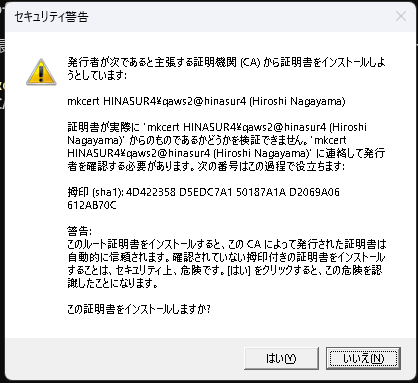

# 環境構築

```bash
~/stack/
  traefik/
    docker-compose.yml
    dynamic/
      certs.yml        # ローカル用の自己署名/社内CA証明書
      # certs/ 内に mkcert で作った *.pem を置く
      certs/
        wiki.local.test.pem
        wiki.local.test-key.pem
        chat.local.test.pem
        chat.local.test-key.pem
        cloud.local.test.pem
        cloud.local.test-key.pem
  apps/
    .env               # パスワード/シークレット類
    docker-compose.yml
    data/
      postgres/
      redis/
      nextcloud/
      mattermost/
      outline/

```

chocolateyのインストールとmkcertのインストール

https://zenn.dev/capriblue/articles/25abbfb9e1c343

